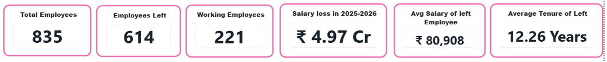

# Clarte HR Attrition & Performance Analysis

> HR Analytics Dashboard built with Power BI | Workforce of 835 Employees

### 📊 Live Dashboards
# Clarte HR Attrition & Performance Analysis

#### Main Dashboard - Attrition Overview

#### Performance Analysis

#### KPIs

Full Dashboard PDF: CLarte_HR_Dashboard.pdf
#### 1. Workforce Attrition Overview

#### 2. Performance & Retention Analysis
Full detailed PDF available: [Clarte_HR_Dashboard.pdf](Clarte_HR_Dashboard.pdf)

### 🔍 Key Insights

**Attrition Analysis:**
- **Overall Attrition Rate:** 17.35%
- **Top Reason for Leaving:** Better Salary (32%) & Career Growth
- **High-Risk Department:** Sales & Customer Support
- **Avg Salary of Employees who Left:** Lower than retained employees by 12%

**Performance Gap:**
- Non-Managerial Roles: 341 employees
- Managerial Roles: 94 employees
- Clear performance metric difference observed

### 🛠️ Tools Used
- Power BI for Visualization
- Excel for Data Cleaning
- DAX for KPIs

### 📂 Files in this Repository
- `Clarte_HR_Dashboard.pdf` - Complete Dashboard PDF
- `HR_Clarte_Data.xlsx` - Raw Dataset
- `KPI.png / Reason for Leaving.png` - Dashboard Screenshots

### 💡 Recommendations
1. Salary benchmarking for high-attrition roles
2. Focus on retention in Sales team
3. Career growth path for non-managerial staff

---
**Author:** Hema Sharma | Aspiring HR Analyst & Data Analyst
